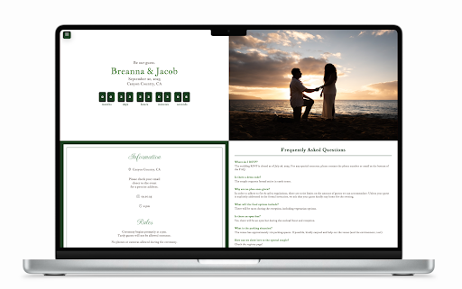
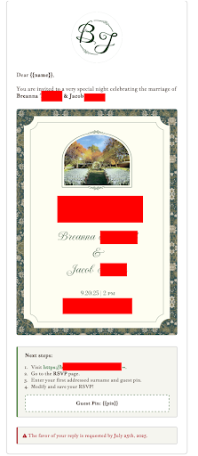

# Wedding Website

This repository contains the source code for a wedding website. The site provides guests with event details, RSVP functionality, and general information (FAQ, Registry, Photos).

The goal of the site is to centralize all wedding information in one place while keeping the experience simple and visually elegant.

---

## Features

- **Event Details**  
  Date, location, and timeline of the wedding celebration.

- **RSVP System**  
  Guests verify their invitation and submit their attendance.

- **Guest Lookup**  
  RSVP verification uses a guest PIN and last name to match entries in the guest database.

- **Dynamic Form Filling**  
  Known guest information (email and mailing address) automatically populates when available.

- **Attendance Management**  
  Guests select the number of attendees up to their allotted amount.

- **Automated Email Confirmation**  
  Guests receive a confirmation email after submitting their RSVP.

- **Responsive Design**  
  Layout adapts to mobile, tablet, and desktop devices.

  
  
---

## Tech Stack

Frontend
- React
- Vite
(Designed in Figma)

Backend
- Node.js
- Python
- Serverless Functions (Vercel)

Database
- MongoDB

Email Service
- Nodemailer
- SMTP provider

Hosting / Deployment
- Vercel

---

## Guest Record Structure

Guest data follows this structure in the database.

Example document:

    {
      "surname": "Johnson",
      "guest_pin": "????",
      "guest_allotment": 5,
      "attendees": 0,
      "addresses": {
        "email": "example@gmail.com",
        "mailing": "1234 Main St"
      }
    }

### Field Descriptions

| Field | Description |
|-----|-----|
| surname | Last name of the invited party |
| guest_pin | Unique PIN used for RSVP authentication |
| guest_allotment | Maximum number of attendees allowed for this invitation |
| attendees | Number of confirmed guests |
| addresses.email | Email used for RSVP confirmation |
| addresses.mailing | Mailing address for invitations or follow-up |

---

## RSVP Flow

1. Guest enters **last name** and **PIN**.
2. Backend verifies the record in MongoDB.
3. If verified:
   - Email and address populate automatically if available.
   - Guest selects number of attendees.
4. Guest submits RSVP.
5. Database updates the guest record.
6. A confirmation email is sent to the guest.

---

## Email Confirmation System

After a successful RSVP submission, the backend sends a confirmation email to the guest.

Emailing system also used to send announcements and updates to different target audiences (invitees, rsvp'ed guests, etc.).

Email sending is handled using **Nodemailer** through an SMTP provider.

---

## Privacy

Guest data is stored securely and used exclusively for managing wedding attendance and sending RSVP confirmations.
